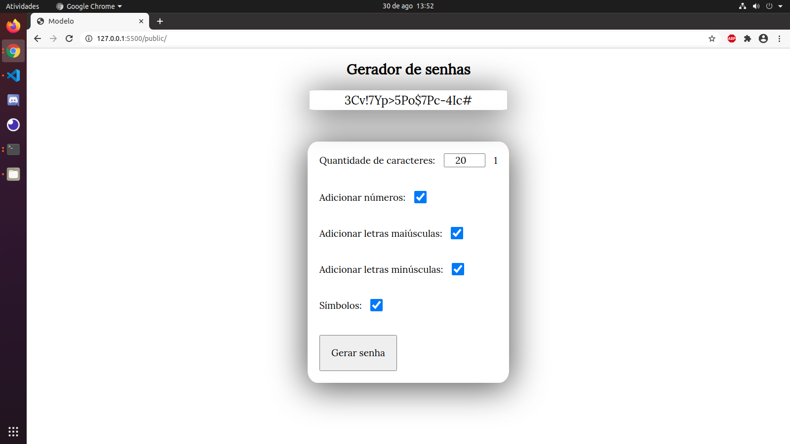

<h1>Password generator</h1>

  Password generator made using html, css, pure JavaScript and webpack 

## Getting Started

install dependencies: <b>npm install</b> 

modify files: <b>npm run dev</b>

open the files with a server, the vscode live server extension is very good

## Build with

    <ul>
        <li><a href="https://developer.mozilla.org/pt-BR/docs/Aprender/JavaScript">JavaScript</a></li>
        <li><a href="https://developer.mozilla.org/pt-BR/docs/Web/HTML">Html</a></li>
        <li><a href="https://developer.mozilla.org/pt-BR/docs/Web/CSS">Css</a></li>
       <li><a href="https://webpack.js.org/">WebPack</a></li>
    </ul>

## Images

## License

This project is licensed under the MIT License - see the [LICENSE.md](LICENSE.md) file for details
